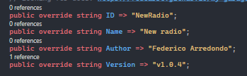
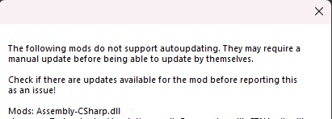
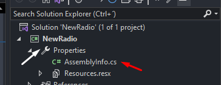
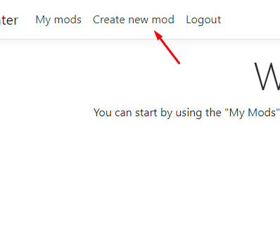
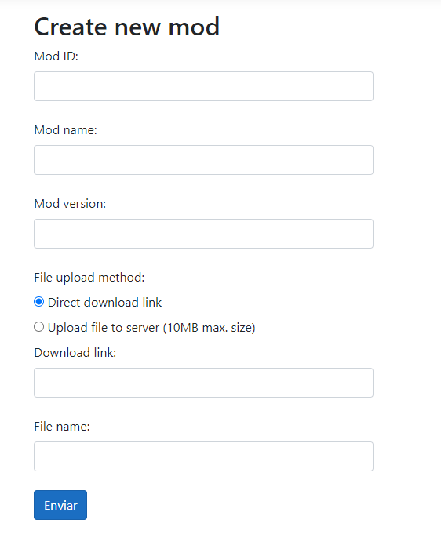
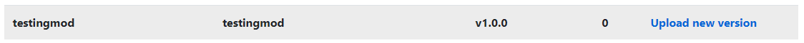

# Autoupdating

## NOTE: This guide is marked as Outdated and will be updated very soon!

ModUtils adds the possibility for mods to update by themselves. This guide explains how to add proper support for your mods.

### Getting the mod ready

The autoupdater works by reading directly the properties from the Mod class of your mod.



Due to how some mods are built, the autoupdater software may not be able to read the information about the assembly properly. To check if this happens with your mod, open the Autoupdater.exe file (Located on Mods/NewAutoupdater) and wait until it finishes loading. If your mod is not compatible you will see a message like this one:



If this happens with your mod, don't worry! ModUtils provides a way to workaround this. On the Visual Studio project of your mod, open the properties and go into the AssemblyInfo.cs file.



Then, go to the bottom of the file and add the following code snippet

```cs
[assembly: AutoupdaterID("Your mod ID")]
[assembly: AutoupdaterName("Your mod name")]
[assembly: AutoupdaterVersion("Your mod version")]
```

Fill the strings with the same information as your properties on the Mod class and now the file will be supported!

Now, when updating the mod make sure to update both the version on the mod properties and also the version on the AssemblyInfo.cs file.

### Adding it to the developer page

Developers first need to register on the [developer page](https://mygaragemod.xyz/) and after getting the account approval they can start adding their own mods to the page.

First thing you need to do is go to the "Create new mod" section.



After opening it, you will see the following form.



You have to fill it with the following information:

| Name in form  |  What goes here |
|---|---|
| Mod ID  | The ID of your mod. Has to be unique and the same as the one located on your mod's code |
| Mod name | The name of your mod. Doesn't need to be unique |
| Mod version | The version of your mod. Has to be exactly the same as the one located on your mod's code |
| File name | The name of your mod assembly (dll). Adding the .dll extension is optional (will be done automatically) |

Then, you have to choose how to upload your mod. If your mod is small and weights less than 10 MB you can directly upload it to the autoupdater server, but for bigger mods you will need to host it somewhere.

Best place to do so is Github, upload it to a repository and get the direct download link for the file (The URL will end up with ".dll")

After adding all the information, you can submit your mod and if everything goes well, your mod will be added succesfully. Go to "My mods" section and check it out.



To upload a new mod version, press on the "Upload new version" button next to your mod and fill the form (Works same way as creating the mod, but you only need to fill the file upload method and the new version).