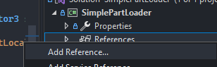
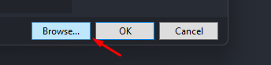
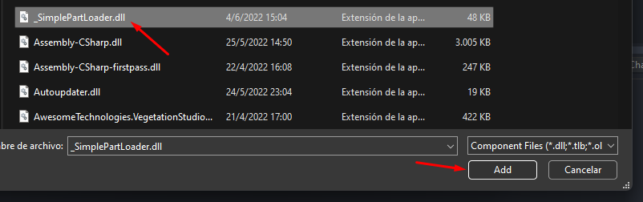

# First steps

*Note that the guides expect you to have knowledge on both Unity and C#. Doing mods for a game is probably the worst way to start learning how to code!*

To start to develop mods using ModUtils you will need to download both the version for users (.dll) and also the developer files (This is a Unity project containing all the basics thing you need to start working). You can find everything on the [downloads section](downloads.md).

Having both files downloaded you just need to add a reference to the ModUtils (The _SimplePartLoader.dll) into your mod project and you are ready to go!







After adding the reference in your project, you just need to add the following on the top and you are ready to start using the ModUtils features!

```csharp
using SimplePartLoader;

// Note that is called SimplePartLoader for compatibility reasons!
```