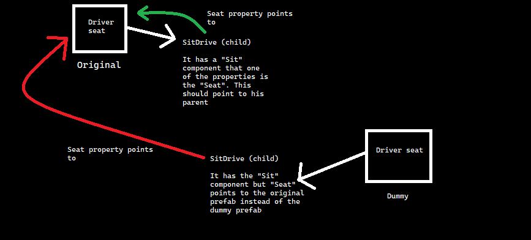

# Fixing broken dummy parts

## NOTE: This guide is marked as Outdated and will be updated very soon!

Due to how the concept of dummy parts work, some things may break after cloning them. On most cases, is due to some references pointing to the original prefab instead of the new one.

Imagine that you create a dummy that clones the driver seat from a car, but when you get into it the game crashes. What happened?



As you can see on the diagram, the issue is simple. Because the "Sit" component was cloned exactly as the original it still points to the original seat instead of the new one. On this case, you would need to manually fix the issue through code.

```cs
Part RacingDriverSeat;

public ModMain()
{
    RacingDriverSeat = SPL.LoadDummy(MyBundle, "NewDrivingSeat");

    SPL.FirstLoad += OnFirstLoad;
}

public void OnFirstLoad()
{
    // CopyPartToPrefab is used here but same issue would happen if you were using prefab generator.
    // The example uses the function to be more clear about what is being copied
    SPL.CopyPartToPrefab(RacingDriverSeat, "SeatFL06");

    // Although it seems a hard line to understand, is pretty easy.
    // We look up for the "SitDrive" child. We get the Sit component from it
    // Then we set the seat property to the transform of our seat and that's it.
    RacingDriverSeat.Prefab.transform.Find("SitDrive").GetComponent<Sit>().seat = RacingDriverSeat.Prefab.transform;
}
```

But this is just one example of something that can break due to dummy parts. A small list of known things that will break is provided down below, but there are probably more parts that break.

- Driver seat and passanger seat. (Use fix above)
- Any fluid component will fully break, you need to manually fix the FLUID component (Make the Container point to itself, fix visual fluid if applies) and also you need to fix the cup of the fluid container. (PickupCup component will have reference to wrong FLUID component)
- Any special structure with transparents, for example headliner (Gets attached by mirror through ATTACHABLES) or cylinder block (Head gasket gets attached by clinder head). The fix for this is to use [UpdateTransparentsReference](api/spl/updatetransparentsreference.mdd).
- Dipstick on cylinder block, update the FLUID on PickupCup.
- All windows, the fix is to enable precise cloning on the [LoadDummy](api/spl/loaddummy.mdd). 

If you have found other case, please report it [here](https://github.com/FedeArre/ModUtils/issues) so it can be added to the list!