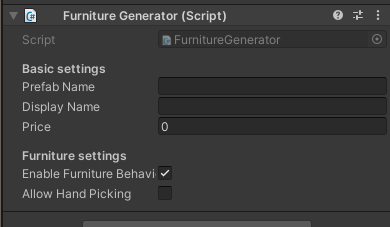

# Furniture generator

## NOTE: This guide is marked as Outdated and will be updated very soon!

ModUtils 1.2 introduced a new feature for developers: Furniture support. It allows to easily create new furniture for the game handling most of the stuff for you.

To start, set up your model on Unity, then add a "Furniture Generator" component for it.

The component has the following settings availables



Setting name | Function
------------ | --------
Prefab name | Unique name to identify the part internally. Make sure that is unique since is used for saving.
Display name | Name that the player will see when looking at the furniture
Price | The price of the furniture on shop
Enable furniture behaviour | If the furniture can be only picked up with move tool and freezes after a bit
Allow hand picking | Only works when furniture behaviour is enabled. Allows to move the furniture with hand but it will still freeze after a bit

Then, after setting up your furniture, create a prefab with it and add it to an AssetBundle, then load the bundle through code and just load the furniture.

```cs
using SimplePartLoader;

ModInstance ThisMod;

public ModMain()
{
    ThisMod = ModUtils.RegisterMod(this);

    AssetBundle MyBundle = AssetBundle.LoadFromMemory(Properties.Resources.Bundle);

    Furniture exampleFurniture = ThisMod.LoadFurniture(Bundle, "MyFurniture");
    exampleFurniture.CreateSaleItem(SaleFurniture.DEFAULT_MODSHOP_LOCATION, Vector3.zero);

    MyBundle.Unload(false);
}
```

With this, our furniture will spawn on the mod shop on a default location. To setup the coordinates of your furniture using a tool like UnityExplorer is recommended.