# Using the prefab generator

## NOTE: This guide will be replaced on the future

The prefab generator is a ModUtils feature added on SimplePartLoader v1.4 that allows developers to create dummy parts (Parts that are empty and get a game part copied into them on runtime) on the Unity Editor. To start off, download the developers file (Is an Unity Project) if you already didn't (Available on [Downloads section](downloads.md)).

Now open the Unity Hub and open the downloaded project

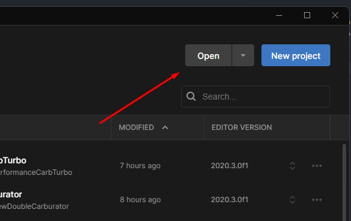

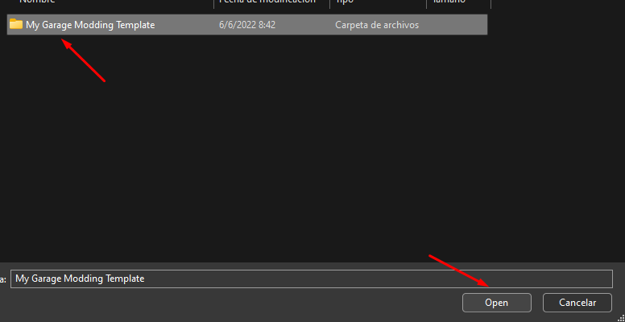

Create an empty GameObject and add the "Prefab Generator" component into it, you will see the following

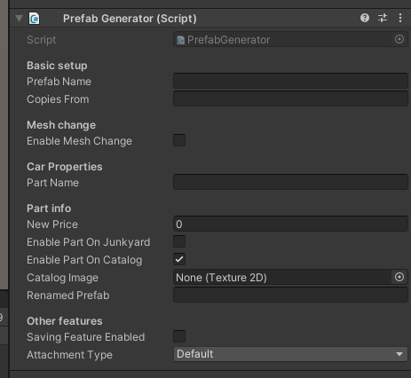

This simple table explains what is every attribute for:

Name | Description | Default value | Required
-----|-------------|---------------|---------
Prefab name | This is the prefab name of the object. It has to be unique and is required. Corresponds to CarProperties.PrefabName | null | Yes
Copies from | The name of the part that will be copied into this part. It has to correspond to the GameObject name | null | Yes 
Enable mesh change | Change the mesh of the part into the one in your prefab? Requires a MeshFilter and Mesh Collider | false | No
Part name | Changes the part name to the specified. Leaving empty will reuse the one from the original | null | No
New price | Changes the part price on catalog. Positive values will be set as price and negative values will sum up to the original prices | 0 | No
Enable part on junkyard | Allows part to spawn on junkyard and survival | false | Yes
Enable part on catalog | Allows part to appear on catalog | true | Yes
Catalog image | The image that should appear on catalog. Will reuse the image from the original part if not set | null | No
Renamed prefab | Corresponds to Partinfo.Renamedprefab, if unused will be set to default value of original part | null | No
Saving feature enabled | Enable custom saving for this part? | false | No
Attachment type | The attachment type that the part will use | Default | --

After creating your part and setting it up on the editor, you need to save the object as a prefab. To do this simply drag the GameObject into the Assets folder. 

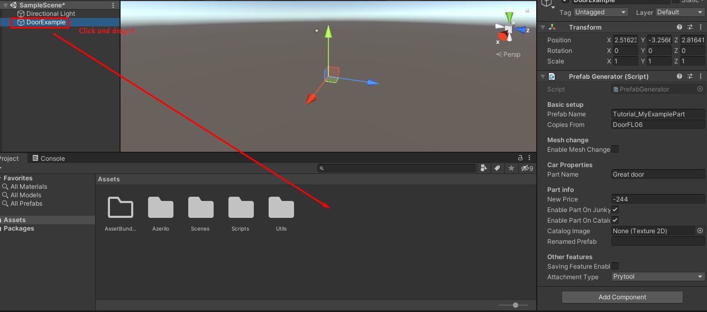

Then, you have to create an AssetBundle and assign it into your prefab. After this you can just right click on the Assets folder and press "Build AssetBundles".

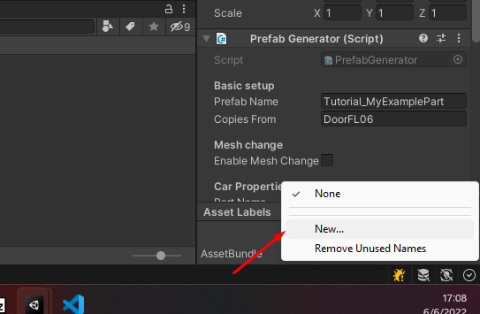

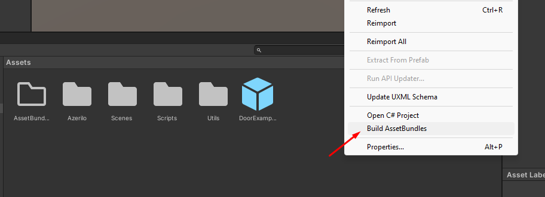

After it finishes, you will find some new files on the "AssetBundles" folder. You need to use the one that does not have icon and has the same name as your bundle.

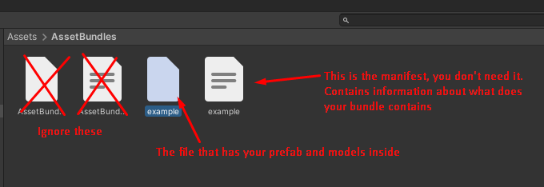

For getting the path of your AssetBundle, right click on it and press "Show on explorer". Keep the path to it since you will need it now. Now go to your mod on Visual Studio, right click your project and enter into the Properties section.

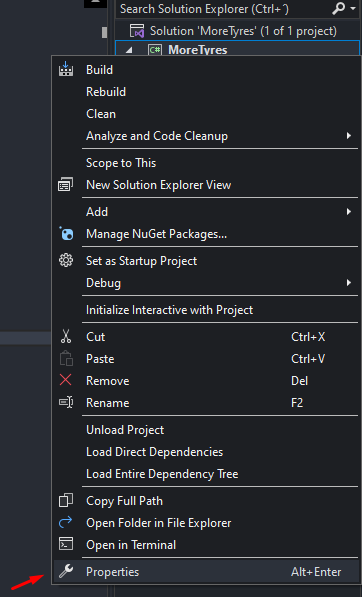

Go into the "Resources" section, create the resources file and now press "Add Resource". Then go to the path of your AssetBundle.

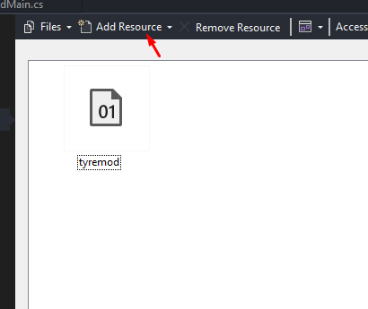

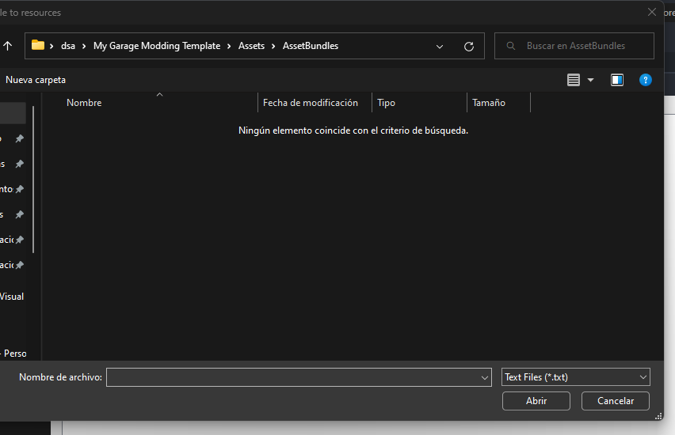

You can see that the folder seems empty, but actually is because by default Visual Studio only looks for txt files. You have to set "All files" on the bottom right.

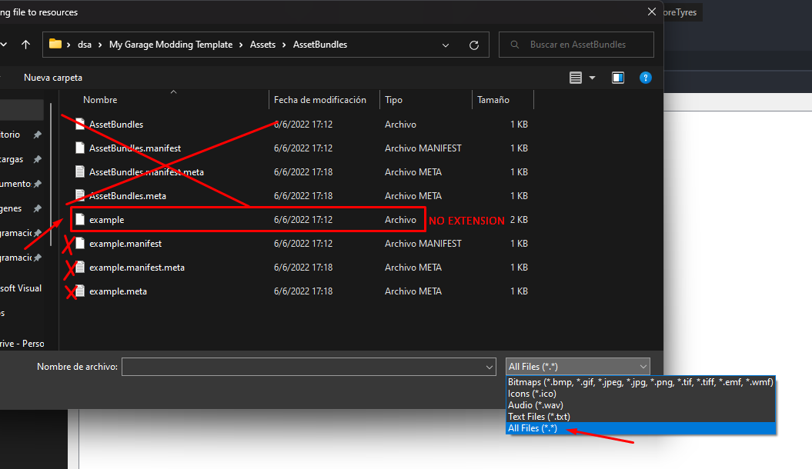

Add the bundle and now you can start using it!
```csharp
using SimplePartLoader;

public ModMain()
{
    AssetBundle bundle = AssetBundle.LoadFromMemory(Properties.Resources.example);

    Part greatPart = SPL.LoadDummy(bundle, "DoorExample");

    bundle.Unload(false);
}
```

With this, your part should appear on the game already!
As an important note, parts generated using the editor are created **before** the FirstLoad call, so you can already interact with the part on the FirstLoad call.

```csharp
using SimplePartLoader;

Part greatPart;

public ModMain()
{
    AssetBundle bundle = AssetBundle.LoadFromMemory(Properties.Resources.example);

    greatPart = SPL.LoadDummy(bundle, "DoorExample");

    SPL.FirstLoad += FirstLoad;

    bundle.Unload(false);
}

public void FirstLoad()
{
    greatPart.CarProps.PartName = "Renamed door now"!
}
```

## Using mesh change <!-- {docsify-ignore} -->

You can change the mesh for your part by enabling the "Enable Mesh Change" on the options of the prefab generator. For this to work, your part has to contain a mesh filter, a mesh renderer with the materials of your object and a **convex** mesh collider. Remember that on the game car parts only support having a single mesh collider (No other types of colliders) and the scale of the mesh gets reseted to Vector.one always!

